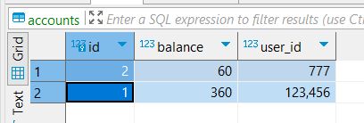
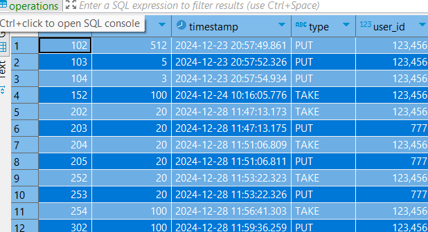
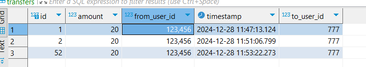

# Entity
- Account(id, userId, balance)
- Operation(id, userId, type, amount, timestamp)
- Transfer(id, fromUserId, toUserId, amount, timestamp)
- 
# Operations
- getBalance: api/getBalance
- takeMoney: api/takeMoney
- putMoney: api/putMoney
- getOperationList
- transferMoney

# POSTMAN api file

https://github.com/TatuAnat/finaltask/blob/main/src/main/resources/TransferMoney.postman_collection.json